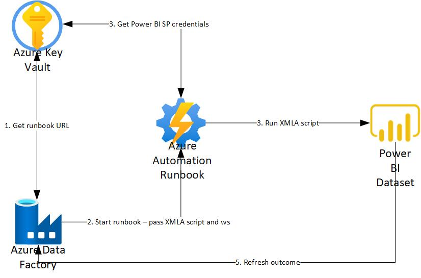
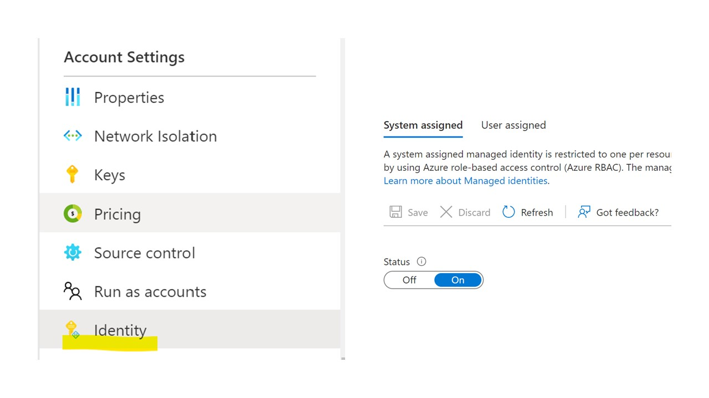
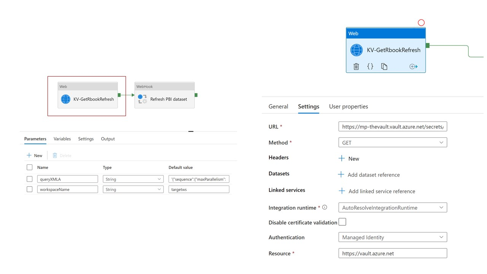
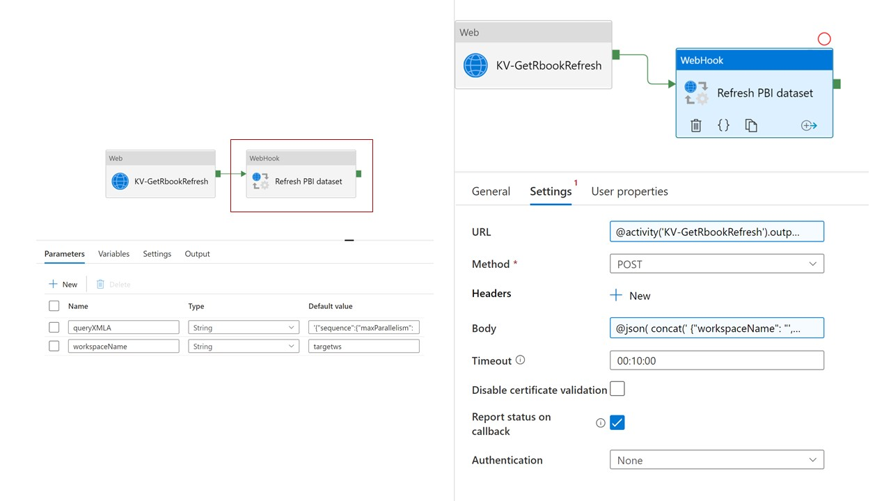
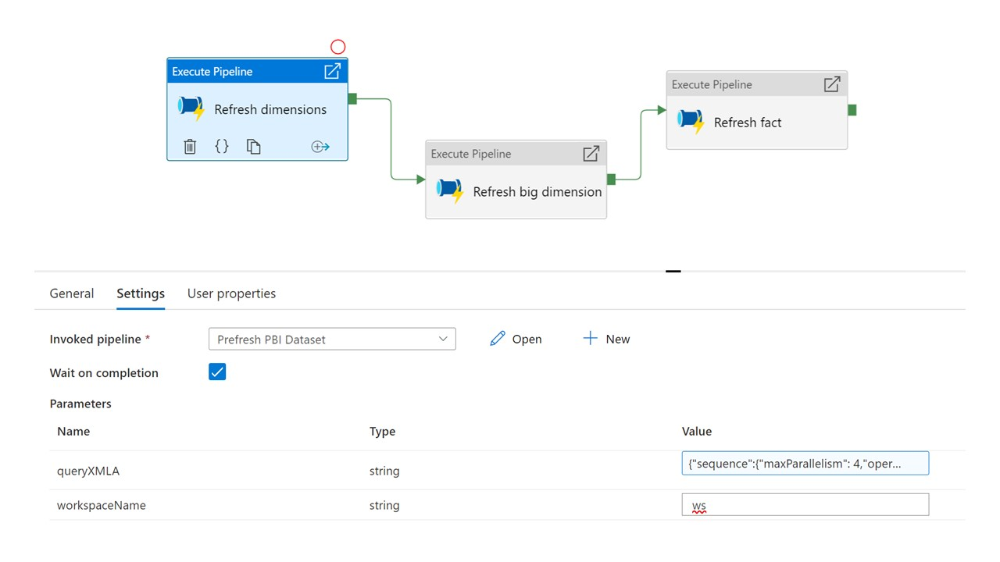

# Automate table / partition level dataset refresh
Use the PBI XMLA endpoint to automate table and partition level refreshes for PBI datasets

In this technical article I will describe how to use the [XMLA endpoint](https://docs.microsoft.com/en-us/power-bi/admin/service-premium-connect-tools) that Power BI Premium exposes in order to refresh individual tables or partitions from a dataset. This should give you extra control when designing your dataset refresh strategy, enabling scenarios like the ones below:

* Refresh a small part of your model (for example a partition of the fact table) frequently during the day, in order to have low latency data in your report. Refresh the rest of the model less frequently
* Decrease the amount of memory needed to perform a full data refresh (approx 2.5x the dataset size) by refreshing tables and partitions sequentially 
* Only refresh the parts of the dataset that are subject to change, skipping static tables or historical data and saving resources

Since the Power BI APIs do not currently allow me to specify which table or partition in a dataset I wish to refresh (like [Azure Analysis Services](https://docs.microsoft.com/en-us/azure/analysis-services/analysis-services-async-refresh) does), I am using the PowerShell Invoke-ASCmd to do that. I am using an Azure Automate Runbook to run my code, Azure Data Factory to schedule and orchestrate my refreshes and Azure Key Vault to store all the sensitive information. 




*  Step 1: Create a Service Principal in Power BI and grant it the correct permissions. This service identity will be used by the Automate Runbook to trigger the dataset refreshes. Please refer to [this technical article](https://github.com/lipinght/PBICookbook/blob/main/ServicePrincipal/ServicePrincipal.md) for details on how to do this. 

*  Step 2: Create an [automation account](https://docs.microsoft.com/en-us/azure/automation/quickstarts/create-account-portal#:~:text=%20Create%20Automation%20account%20%201%20Sign%20in,in%20the%20notification%20to%20open%20the...%20More%20). Make sure you have the SqlServer and Az.KeyVault [modules installed](https://docs.microsoft.com/en-us/azure/automation/shared-resources/modules). In order to use the Automation's managed identity when communicating with Azure Key Vault, set the Status of the System assigned identity to **On**, under the Identity menu (see below)



*  Step 3: Create an [Azure Key Vault](https://docs.microsoft.com/en-us/azure/key-vault/general/quick-create-portal) account. Add the relevant secrets for connecting to the Power BI tenant (in my case I added the Tenant ID of the Power BI tenant where my dataset is, the service principal name and password for the Service Principal created in Step 1). Under Access Policies, add the Automation managed identity and grant it Get and List secret permissions. 

*  Step 4: Create the following Runbook under your Automate account. The Runbook will be triggered from Azure Data Factory, and will receive the target Power BI Workspace and XMLA script to run as parameters. Save and publish the Runbook. 

```
# Parameters for the Runbook. Expected: destination Power BI Workspace, XMLA update script, callback URI from Azure Data Factory
Param (    
    [Parameter(Mandatory=$False,Position=1)]
    [object] $WebhookData
)

$errorActionPreference = "Stop"

$Parameters = (ConvertFrom-Json -InputObject $WebhookData.RequestBody)

$CallBackUri =  $Parameters.callBackUri
$Query =  $Parameters.queryXMLA
$WorkspaceName = $Parameters.workspaceName


# Set Power BI server address
$Server = "powerbi://api.powerbi.com/v1.0/myorg/$WorkspaceName"

# Ensures you do not inherit an AzContext in your runbook
Disable-AzContextAutosave -Scope Process

# Connect to Azure with system-assigned managed identity
$AzureContext = (Connect-AzAccount -Identity).context
    
# Retrieve the Power BI SP credentials from Key Vault
$PBIAppID = Get-AzKeyVaultSecret -VaultName "mp-thevault" -Name "PBI-AppID" -AsPlainText
$PBIPass = Get-AzKeyVaultSecret -VaultName "mp-thevault" -Name "PBI-Pass" 
$TenantID = Get-AzKeyVaultSecret -VaultName "mp-thevault" -Name "TenantID" -AsPlainText

# Create the credential to connect to the Power BI tenant 
$Credential = New-Object System.Management.Automation.PSCredential ($PBIAppID, $PBIPass.SecretValue)

Try {    

    # Execute the refresh command via the XMLA endpoint
    Invoke-ASCmd -Server $Server -TenantId $TenantID -ServicePrincipal -Credential $Credential -Query $Query  
    
    Write-Output "Results:"
    
    $Body = @{
        StatusCode = "200"
    }

    If ($CallBackUri)
    {
        Write-Output "Invoke call back to ADF with status 200.."

        # Return the success state back to the calling Azure Data Factory pipeline
        Invoke-RestMethod -Method Post -Uri $CallBackUri -Body $Body
    }
}

Catch{
    Write-Output "An error occurred:"
    Write-Output $_

    $Body = @{
        StatusCode = "400"
    }
    Write-Output "Invoke call back to ADF with status 400.."
    If ($CallBackUri)
    {
        # Return the failed state back to the calling Azure Data Factory pipeline
        Invoke-RestMethod -Method Post -Uri $CallBackUri -Body $Body
    }
}
```

*  Step 5: On the published Runbook, add a [new Webhook](https://docs.microsoft.com/en-us/azure/automation/automation-webhooks#from-the-portal). Copy the Webhook URL and add it to Azure Key Vault as a secret. 

* Step 6: Create an [Azure Data Factory](https://docs.microsoft.com/en-gb/azure/data-factory/quickstart-create-data-factory-portal). 

* Step 7: In your Azure Key Vault, under Access Policies, add the Azure Data Factory managed identity and grant it Get and List secret permissions. 

* Step 8: In Azure Data Factory, create a new Pipeline that will retrieve the Runbook URL from Azure Key Vault, and will call it with the relevant parameters. 



In the above call to Azure Key Vault, you can obtain the relevant URL from the relevant version of the Key Vault secret containing the Runbook Webhook URL. More details on how to do this [here](https://docs.microsoft.com/en-us/azure/data-factory/how-to-use-azure-key-vault-secrets-pipeline-activities).



When using the Webhook call, use the URL obtained previously as the Webhook URL. Construct the Body of the message using the queryXMLA and workspaceName parameters. The use of parameters will allow for calling the same pipeline for different workspaces or XMLA scripts. Also check the **Report status on callback** option - this will allow Azure Data Factory to show if the Runbook completed successfully or failed.

Body expression used:
```
@json(
	concat(' 
		{"workspaceName": "',pipeline().parameters.workspaceName,'",
                 "queryXMLA": ''',pipeline().parameters.queryXMLA,'''
                 }'
		)
	)
```

* (optional) Step 9: The pipeline above can now be called from other pipelines with different arguments, as part of more complex orchestrations.


In this example I call the pipeline above multiple times, with different parameters, in order to refresh subsets of tables and partitions sequentially. Each activity will call the pipeline defined in step 7 and will specify the target workspace and XMLA script to be executed. 

#### XMLA script example 1 - fully refresh a table called Customer from a dataset called adventureworks.
```

{"sequence":{"operations": [{"refresh": 
                    {"type": "full","objects": 
                        [
                            {"database": "adventureworks","table": "Customer"}
                            ]
                            }
                        }]}}

```
#### XMLA script example 2 - fully refresh a table called SalesOrderHeader and a partition called PartitionBlack from a dataset called adventureworks.

```
{"sequence":{"operations": [{"refresh": 
                    {"type": "full","objects": 
                        [
                            {"database": "adventureworks","table": "Product", "partition": "PartitionBlack"},
                            {"database": "adventureworks","table": "SalesOrderHeader"}
                            ]
                            }
                        }]}}
```
#### XMLA script example 3 - fully refresh a table called SalesOrderDetail from a dataset called adventureworks, while also specifying a max parallelism of 10.
```
{"sequence":{"maxParallelism": 10,"operations": [{"refresh": 
                    {"type": "full","objects": 
                        [
                            {"database": "adventureworks","table": "SalesOrderDetail"}
                            ]
                            }
                        }]}}
```


## Reference List:
- [Data - Marc: Automate Power BI single table refresh using Azure Data Factory and Azure Automation](https://data-marc.com/2021/10/28/automate-power-bi-single-table-refresh-using-azure-data-factory-and-azure-automation/)
- [Artful Data Nerd: Power BI and the Service Principal](https://www.artfuldatanerd.com/post/power-bi-and-the-service-principal)
- [Chris Webb's BI Blog: Increasing Refresh Parallelism and Performance In Power BI Premium](https://blog.crossjoin.co.uk/2021/06/27/increasing-refresh-parallelism-and-performance-in-power-bi-premium/)
